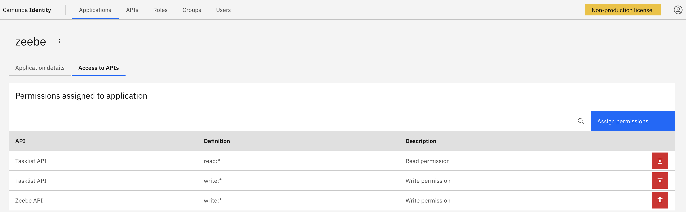

# Spring Boot Samples

<!-- TOC -->
* [Spring Boot Samples](#spring-boot-samples)
  * [Run Locally](#run-locally)
    * [Run Camunda locally](#run-camunda-locally)
      * [Add permissions to the `zeebe` application](#add-permissions-to-the-zeebe-application)
    * [Run a mock API server](#run-a-mock-api-server)
    * [Run the application](#run-the-application)
<!-- TOC -->

## Run Locally

### Run Camunda locally

Run Camunda locally as explained [here](../docker/README.md).

#### Add permissions to the `zeebe` application

The `zeebe` client is configured in `application-local.yaml` and used to access the Tasklist.  

```yaml
zeebe:
  client:
    cloud:
      client-id: zeebe

tasklist:
  client-id: ${zeebe.client.cloud.client-id}
```

We therefore need to:  

* log in to [Identity](http://localhost:8084),  
* edit the `zeebe` application,  
* and add Tasklist read/write permissions.



### Run a mock API server

If the sample calls any external APIs, run [a mock API server](./mock-api/README.md) locally.

### Run the application

The [Spring Boot Maven Plugin](https://docs.spring.io/spring-boot/docs/current/maven-plugin/reference/htmlsingle/) is configured in this [`pom.xml`](./pom.xml) to use the `local` profile by default.

In each module, the `application-local.yaml` file is configured to run against a [local deployment of Camunda](#run-camunda-locally).  

The following command will therefore run using that profile.

> `mvn spring-boot:run`

It is possible to run using another profile by setting the `spring-boot.run.profiles` property, e.g. `-Dspring-boot.run.profiles=dev`, as documented [here](https://docs.spring.io/spring-boot/docs/current/maven-plugin/reference/htmlsingle/#using.overriding-command-line).

The `APIS_HOST` environment variable contains the external APIs' host.  
It is set to `localhost` by default to point to [the local mock API server](#run-a-mock-api-server).  
The mock API server is assumed to run on port `9999`.